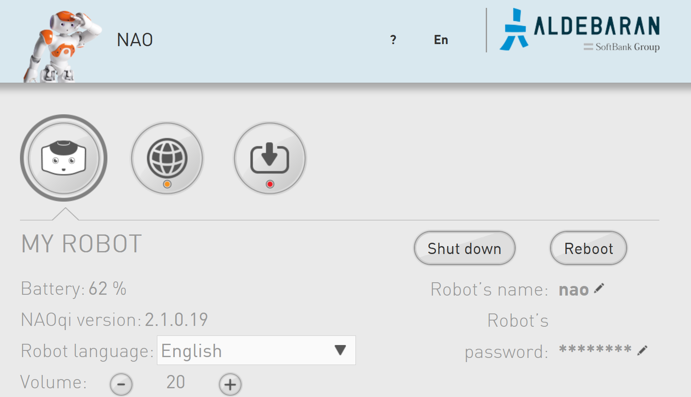
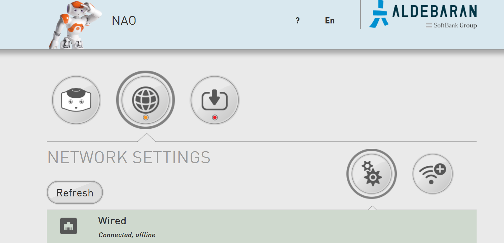

# Neurorobotics Summer School 2022

***

## Introducing NAO
NAO is a humanoid robot, with a variety of functionalities. Here is its [documentation](http://doc.aldebaran.com/2-1/index.html).
A lot of information about the design, e.g. actuators, joints, even LEDs, can be accessed in their website. 
However, in order to program the robot without using GUI (which in this case is called [Choregraphe](http://doc.aldebaran.com/2-1/getting_started/installing.html)) in C++ or Python one needs an SDK for NAO, called NAOqi.
All the dependencies and requirement are already added or installed on your Ubuntu system, e.g. Python 2.7, OpenCV, etc.
In case one would like to see the installation procedure, this [webpage](http://doc.aldebaran.com/2-1/dev/python/install_guide.html) contains all the steps, the possible errors and their corresponding solutions. It should be noted the path to NAOqi is included and there is no need to set the environment as explained [here](http://doc.aldebaran.com/2-1/dev/python/install_guide.html#linux).

To replicate the results here are the dependencies in more detail.
Ubuntu 14.04.6 (32bit)
Python 2.7 (32bit)

```
pip install opencv-python==4.2.0.32
pip install opencv-contrib-python==4.2.0.32
```

# Let’s start

Open a browser and type: `nao.local`

The username and password are both: `nao`

One should be able to see the following images:





Check NAO’s IP by selecting the “Network Settings” and clicking on the “Wired”.
Another way to access the IP (after connecting to a network) is to press NAO’s chest button. It will start reading the IP outloud. 

Now to run a few lines of code on NAO, let’s do the following:
* Open a terminal (if the icon is not already on the dashboard Ctrl + Alt + T in Linux opens a terminal)
* Write down NAO’s IP address either using the NAO’s [webpage](nao.local) or by pressing the chest button (although `nao.local` could be used as the IP address, occasionally it does not work without passing the exact IP, e.g. `192.168.0.1`).
* In the terminal type `python` and press enter.
* Copy & paste these lines in the terminal and replace `"<IP of your robot>"` by the actual IP address:

```
from naoqi import ALProxy
tts = ALProxy("ALTextToSpeech", "<IP of your robot>", 9559)
tts.say("Hello, world!")
```
* Open an IDE of your choosing, e.g. Visual Studio Code, PyCharm, etc., and paste the same lines of code in a new file.
* Save the file as a Python file, e.g. `myHelloWorld.py`.
* Open a terminal window, and go to the directory where the Python file is saved.
* Run the file by command simply typing: `python myHelloWorld.py`.

***

## Exercises

A simple access to NAO and “Text-to-Speech” command was shown. In order to have NAO accomplish more complicated tasks, a series of tasks are defined where their levels of complexity are gradually increased.

The tasks are numbered and one could start from the beginning, i.e. `task_01.py`.

All the files use `argparse`, and thus typing `python task_*.py --help` in terminal would provide the list of arguments.

All the robots are named after the dwarves from the Snow White fairy tale (these names could be seen on stickers behind the robot), e.g. Doc, Sleepy, etc. To simplify the commands and not type the IP address at the beginning a `json` file has been created with all the names and their corresponding IPs. If one wishes to run for example `task_01.py` they could simply type:

```
python task_01.py --NAO_name sleepy
```
While keeping the rest of the arguments as default.


### Task 1: Streaming Video and Middle Tactile Touch Detection

In this task one familiarizes oneself with NAOqi and its possibilities. This task is twofold: streaming what NAO’s camera is capturing and always checking if the middle tactile on top of the head is being touched. 

To check how to access the camera, please visit the documentation [webpage](http://doc.aldebaran.com/2-1/naoqi/vision/alvideodevice-api.html#ALVideoDeviceProxy::subscribeCamera__ssCR.iCR.iCR.iCR.iCR). Key points are that one should subscribe to the camera with their preferred parameters, e.g. resolution, frame rate, or even the camera index (specifying which of the two camera’s located in the NAO’s head should be used), these configurations are explained in the [documentation](http://doc.aldebaran.com/2-1/family/robots/video_robot.html). Ultimately, one should unsubscribe from the camera once the routine is finished.

After subscribing to the camera, one could retrieve its images, and stream them. The object received from `getImageRemote` contains different information from the size of the image to the raw data. Using the retrieved information one could reshape the raw data into a format that is readable by OpenCV and finally show them, `cv2.imshow()`.

To check whether the middle tactile is being touched, one could access the sensor values of the sensor located on the middle tactile. A simple method would be to constantly check if the sensor value has been changed, indicating touch. In this example if the middle tactile is being touched the robot would announce that. It is worth noting that in order to avoid multiple readings and executing of the `TextToSpeech` command, a handle variable is keeping track of the previous command to ensure if it is no longer running.

**Your part** could be to do the following:
* Change the camera’s configuration, and compare the difference. 
* Change the middle tactile to another touch sensor, using the [documentation](http://doc.aldebaran.com/2-1/family/nao_dcm/actuator_sensor_names.html#touch-sensors).
* Save an image on the harddrive after pressing the middle tactile. 

### Task 2: Streaming Video and Reacting to an Event (ALBroker and ALModule)

This task is similar to Task 1, but instead of constantly checking the sensor values, one could subscribe to an event, which here would be an event of middle tactile being touched. When the event has occurred (raised) a callback function would be executed. 

**Your part** could be to do the following:
* See the difference in the structure of the code, compared to that of Task 1.
* Change the middle tactile to another touch sensor, using the [documentation](https://fileadmin.cs.lth.se/robot/nao/doc/naoqi/sensors/altouch-api.html#event-list).
* Save an image on the harddrive after pressing the middle tactile.


### Task 3: Execution of Motion Command

The core of the code in Task 3 is the same as Task 2. The only difference is that when the front tactile is touched the head moves to the left, to the center when the middle tactile is touched, and finally to the right if the rear tactile is touched.

In this task one could see how the motion proxy is being defined, how a joint is moved, by assigning a stiffness and an angle (as well as the speed with which it should reach that angle).

**Your part** could be to do the following:
* Check the [documentation](http://doc.aldebaran.com/2-1/family/robots/joints_robot.html#joints) to see the joint limits, particularly for the [head](http://doc.aldebaran.com/2-1/family/robots/joints_robot.html#head-joints). Note that the angles passed to `setAngles` should be in radians, see the [documentation](http://doc.aldebaran.com/2-1/naoqi/motion/control-joint-api.html?highlight=setangles#ALMotionProxy::setAngles__AL::ALValueCR.AL::ALValueCR.floatCR).
* Write a routine that is executed whenever one of the tactiles are being touched, and accordingly rotates the head towards a predefined angle.


### Task 4: Controlling the LEDs

This task is designed based on Task 3. In the previous task touching the tactiles would rotate the head towards a predefined angle. Here on top of the motion, LEDs in the eyes would be controlled and change color, see [documentation](http://doc.aldebaran.com/2-1/naoqi/sensors/alleds.html#alleds) for more detail.


**Your part** could be to do the following:
* Implement a condition where if more than a predefined number of times any of the tactiles are touched NAO’s eyes would turn red, indicating its reluctance to follow your commands any longer. The condition should reset after it reaches the maximum number of commands. In other words, a counter should be defined to keep track of every time a tactile is being touched, upon reaching its maximum number of times, NAO’s eyes should turn red, after which the eyes would turn back to the normal color (blue) and the counter is reset to zero (see the [documentation](http://doc.aldebaran.com/2-1/naoqi/sensors/alleds-api.html#ALLedsProxy::fadeRGB__ssCR.floatCR.floatCR.floatCR.floatCR) for more detail).


### Task 5: Detecting a colored Ball

The code is using the already discussed structure of capturing images from NAO’s camera. However, in order to detect a particular color in the captured image one should filter the image for that color. If there is no other object in the image with the same color range, one could assume only the ball is the detected object (the masked image based on the color is also shown during the stream). Once the object(s) with that particular color is/are found the center of mass of those regions could be extracted, all of which achievable using OpenCV library.


**Your part** could be to do the following:
* Find the upper and lower bound for a specific color so the ball in that color could be detected without any problem, e.g. using this [website](https://colorizer.org/).
* Familiarize yourself with the `DetectBall` routine, and how it filters the image and finds the center of certain regions.


### Task 6: Tracking a colored Ball

This task is designed based on Task 5. However, now the head is following (tracking) the ball when the ball is moving.

**Your part** could be to do the following:
* Track the ball so that the ball is always in the center of the camera view. Having the information about the center of the detected ball, one should be able to move the joints in the head (“HeadPitch” and “HeadYaw”) in order for the camera to always see the ball in the center of its captured view.

